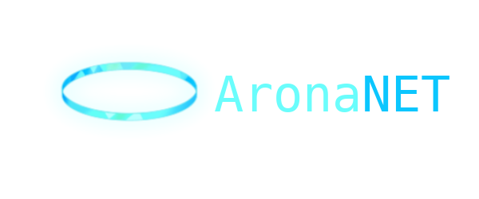

<div align="center">
    
    <br>
    
    
</div>
<br>

**Lightweight peer-to-peer-ish network layer with TUI controls**\
A flexible networking system with encryption, auth, tunnel support, and a Textual-based TUI interface.

---

## Features

* **Encrypted Client–Server Communication** – Clean protocol, handshake, user auth
* **Automatic Bore Tunnel Support** – Public endpoint exposure via `bore`  
  _Example server output:_
  
```
[*] Server listening on 127.0.0.1:47500
[*] Starting bore tunnel...
[✓] Bore connected: AoNET/TCP://bore.pub:45925
[✓] Public URL: AoNET/TCP://bore.pub:45925

[*] Server ready! Press Ctrl+C to stop

[+] Connection from ('127.0.0.1', 58666)
[✓] Handshake complete with ('127.0.0.1', 58666)
[✓] "cheese" authenticated from ('127.0.0.1', 58666)
````

* **Textual TUI (Planned)** – Config, client list, logs, connection control
* **Port Discovery (Planned)** – Auto-detect + auto-forward ports
* **Portable** – Works on Linux, and Termux (if you can wait long enough for Cryptography to compile)
* **Future Mobile APK** – Maybe… eventually…

---

## Installation

```bash
git clone https://github.com/XeonXE534/AronaNET.git
cd AronaNET
bash ./install.sh
````

Run the server:

```bash
aonet-server
```

Run the client:

```bash
aonet-client bore.pub {bore port provided by server}
```

---

## Requirements

* **Python 3.10+**
* **bore CLI**
* **Textual** – for the upcoming TUI interface

---

## Roadmap

* [x] Basic encrypted communication
* [x] Server–client handshake + auth
* [x] Bore public tunnel support
* [ ] Auto port discovery 
* [ ] Full Textual-based TUI
* [ ] QoL features: user management, config editor, logs
* [ ] Mobile APK (long-term dream)

---

## Notes

* The TUI is still WIP. Right now everything is CLI-based.
* Probably works on Termux if you can wait long enough for Cryptography to download and PiP thing. I cant

---

## Contributing

PRs welcome!
If you can make the TUI less cursed or the networking more sane, please do.

---

## License

GPL 3.0, see LICENSE for details.

---

## Credits

* Tunneling: [Bore](https://github.com/ekzhang/bore)
* TUI: [Textual](https://github.com/textualize/textual)
---

## Disclaimer

AronaNET is an independent, open-source project and is not affiliated with, endorsed, or sponsored by Nexon Games, Yostar, or Blue Archive.
The character Arona and related assets belong to Nexon Games Co., Ltd.
All character references are for fan and educational purposes only.

If you are a copyright holder and believe any content used here violates your rights, please open an issue or contact me - I'll remove it immediately.
